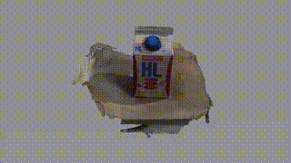
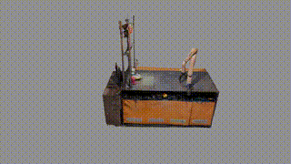
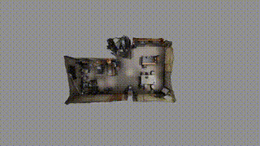
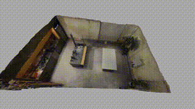

# Gaussian Splatting Toolkit 🛠️






<p align="center">
  <a href="https://gaussian-splatting-toolkit.readthedocs.io">Documentation</a> |
  <a href="https://github.com/Gaussian-Splatting-Toolkit/Gaussian-Splatting-Toolkit">GitHub</a>
</p>

[](https://opensource.org/licenses/MIT)

The Gaussian Splatting Toolkit is a cutting-edge collection of tools designed for new view synthesis using Gaussian splatting techniques, providing a novel explicit 3D representation for scene rendering.

## Table of Contents 📖

<details>
  <summary>Table of Content</summary>

- [Gaussian Splatting Toolkit 🛠️](#gaussian-splatting-toolkit-️)
  - [Table of Contents 📖](#table-of-contents-)
  - [Introduction 🎉](#introduction-)
  - [Features 🌟](#features-)
  - [Installation 💻](#installation-)
  - [Quick Start 🚀](#quick-start-)
    - [Download the opensource datasets](#download-the-opensource-datasets)
    - [Data processing](#data-processing)
    - [Train the Gaussian Splatting](#train-the-gaussian-splatting)
    - [Visualize the result](#visualize-the-result)
    - [Render the rgb and depth](#render-the-rgb-and-depth)
    - [Export](#export)
  - [Contribute 🤝](#contribute-)
  - [License 📄](#license-)
  - [Citation 📚](#citation-)
  - [TODO 📝](#todo-)
  - [Acknowledgements 🌟](#acknowledgements-)

</details>

## Introduction 🎉

A Gaussian Splatting Toolkit for robotics research, developed based on nerfstudio.

## Features 🌟

- **Camera Calibration**: Calibrate the camera intrinsics.
- **Vanilla Gaussian Splatting Training Pipeline**: Inherented from Gausplato.
- **Depth Alignment**: Align the scale of reconstruction using depth map.
- **Depth Supervision**: Both sensor depth supervision and mono depth estimation supervision.
- **Mesh Extraction**: Achieves the best practice so far.

## Installation 💻

Using conda:

```bash
conda create -n gstk python=3.10.13 -y
conda activate gstk
pip install torch torchvision
pip install -e .
```

This repository also provides a devcontainer for your convenience.

## Quick Start 🚀

<details>
  <summary>Table of Content</summary>

  ### Download the opensource datasets

  ```bash
  gs-download-data gstk --save-dir /path/to/save/dir --capture-name all
  ```

  ### Data processing

  ```bash
  # Extract from images
  gs-process-data images --data /path/to/rgb/folder --output-dir /path/to/output-dir
  # Extract with both rgb and depth
  gs-process-data images --data /path/to/rgb/folder --depth-data /path/to/depth/folder --output-dir /path/to/output-dir
  # Process with mono depth estimation
  gs-process-data images --data /path/to/rgb/folder --output-dir /path/to/output-dir --using-est-depth
  # Process with mask
  gs-process-data images --data /path/to/rgb/folder --using-est-depth --mask-data /path/to/mask/folder --output-dir /path/to/output-dir
  ```

  ### Train the Gaussian Splatting

  ```bash
  gs-train gaussian-splatting --data /path/to/processed/data
  gs-train co-gs --data /path/to/processed/data
  # Train with mono depth estimation
  gs-train co-gs --data /path/to/processed/data --pipeline.model.use-est-depth True
  ```

  ### Visualize the result

  ```bash
  gs-viewer --load-config outputs/path/to/config.yml
  ```

  ### Render the rgb and depth

  From trajectory

  ```bash
  gs-render trajectory --trajectory-path /path/to/trajectory.json --config-file /path/to/ckpt/config.yml
  ```

  From camera pose

  ```bash
  gs-render pose --config-file /path/to/config.yml --output-dir /path/to/output/folder/
  ```

  ### Export

  Export the gaussians as ply

  ```bash
  gs-export gaussian-splat --load-config /path/to/config.yml --output-dir exports/gaussians/
  ```

  Export camera poses

  ```bash
  gs-export camera-poses --load-config /path/to/config.yml --output-dir exports/cameras/
  ```

  Export the point cloud

  ```bash
  gs-export point-cloud --load-config /path/to/config.yml --output-dir exports/pcd/
  ```

  ```bash
  gs-export offline-tsdf --render-path /path/to/rendered/folder --output-dir exports/tsdf/
  ```

  Export tsdf with mask

  ```bash
  gs-export offline-tsdf --render-path /path/to/rendered/folder --output-dir exports/tsdf/ --mask-path /path/to/mask
  ```

  Export object pointcloud and mesh with prompt

  ```bash
  gs-export offline-tsdf --render-path exports/milk/ --output-dir exports/tsdf/milk_text_seg --seg-prompt your.prompt
  ```

</details>

## Contribute 🤝

We welcome contributions from the community and are grateful for any help you can provide. Here's how you can contribute to the Gaussian Splatting Toolkit:

- Report Issues: If you encounter any bugs or have suggestions for improvements, please open an issue in the repository.
- Submit Pull Requests: Feel free to submit pull requests with bug fixes, new features, or enhancements. Please ensure your code follows the project's coding standards and includes appropriate tests.
- Documentation: Help us improve the documentation by fixing typos, adding examples, or clarifying explanations.
- Community Support: Engage with other users and contributors on GitHub or other platforms to help answer questions and share knowledge.

Before contributing, please review the [CONTRIBUTING.md](CONTRIBUTING.md) file for detailed guidelines.

## License 📄

This project is licensed under the MIT License - see the [LICENSE](LICENSE) file for details.

## Citation 📚

If you use the Gaussian Splatting Toolkit in your research, please cite it as follows:

```bibtex
@misc{gaussian_splatting_toolkit,
  author = {Hu Tianrun},
  title = {Gaussian Splatting Toolkit: A Toolkit for Gaussian Splatting},
  year = {2024},
  publisher = {GitHub},
  journal = {GitHub repository},
  howpublished = {\url{https://github.com/Gaussian-Splatting-Toolkit/Gaussian-Splatting-Toolkit}}
}
```

## TODO 📝

<details>
  <summary>To do list</summary>

  - [x] OpenCV marker ground truth measurement.
  - [x] Surface distance module
  - [ ] Data
    - [ ] Data synthetic with blender
  - [ ] Data preprocessing
    - [x] Colmap preprocessing
    - [x] RGB-D Data processing
    - [ ] Sensor interface
      - [ ] Azure Kinect
      - [ ] iPhone/ iPad
  - [x] Evaluation
  - [x] Gaussian Splatting module
  - [x] Depth Loss
  - [x] Point cloud export
  - [x] Mesh extraction
    - [x] Marching cube
    - [x] TSDF
    - [x] Piossion reconstruction
  - [x] Training
    - [x] Course to fine
  - [x] Mask
  - [ ] Model
    - [ ] Gaussian Splatting SLAM
    - [ ] GaussianShader
  - [ ] Visualization
    - [ ] normal visualization
    - [ ] gaussian ellipsoid visualization
    - [ ] pointcloud
    - [ ] mesh
    - [ ] Any gaussians without loading pipeline
    - [ ] mask prompt
    - [ ] segmentation visualization
  - [x] Render
    - [x] Render GS model without loading pipeline
  - [ ] Documentation
  - [ ] Tests
  - [x] CUDA
    - [x] migrate the rasterizer to cuda-12.1

</details>

## Acknowledgements 🌟

We extend our heartfelt thanks to the following open source projects and their contributors for providing valuable code and resources that greatly assisted in the development of the Gaussian Splatting Toolkit:

- **[NeRF Studio](https://github.com/nerfstudio-project/nerfstudio):** For their innovative algorithms and architecture implementations.
- **[Segment Anything](https://github.com/facebookresearch/segment-anything):** For their robust segmentation algorithm for efficient object selection in GSTK.
- **[Tracking Anything](https://github.com/hkchengrex/Tracking-Anything-with-DEVA):** For their robust object tracking module process.
- **[BlenderSynth](https://github.com/OllieBoyne/BlenderSynth):** For their data generation pipeline.
- **All Open Source Contributors:** A special shoutout to all the developers and contributors in the open source community who share their knowledge and expertise. Your dedication to open collaboration is truly appreciated. 🤝

We are immensely grateful for the generosity of the open source community, which has made this project possible. Your contributions are the backbone of innovation and progress in the tech world. 🌍
